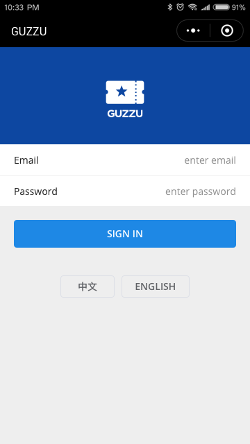

# GUZZU-SHOP开发文档

##  页面Pages

### s1. Sign in (登陆)

1. 商家登陆。API：[Auth.signinWithEmail](https://mp-dev.guzzu.cn/mpapi/2/Auth.signinWithEmail)
2. 选择语言。
3. 按 button 后立即显示 Loading 轻提示，成功和失败都有轻提示
4. 成功后 wx.redirectTo "s2" 主页

### s2. Scan（主页Tab：获取电子券信息）

1. 可选店铺。进入本页时自动选权限表的第一个店铺。点击可 wx.navigateTo "s3"
2. 扫描二维码和输入券码。API：[UserTicket.get](https://mp-dev.guzzu.cn/mpapi/2/UserTicket.get) 用 wx.navigateTo 去下一页 s5 或 s6
3. 输入券码后立即显示 Loading 轻提示，成功和失败都有轻提示

### s3. Select store (选择店铺)

* 记得用 localStorage 记住选好的店铺

### s4. Settings (设置Tab)

* 可选择语言。
* 登出 API：[Auth.signout](https://mp-dev.guzzu.cn/mpapi/2/Auth.signout)

### s5. Active ticket（未核销门票详细信息）

1. 得到票券信息。API：[UserTicket.get](https://mp-dev.guzzu.cn/mpapi/2/UserTicket.get)
2. 得到购买者信息。API：[Customer.getByUserId](https://mp-dev.guzzu.cn/mpapi/2/Customer.getByUserId)
3. 核销。API：[UserTicket.consume](https://mp-dev.guzzu.cn/mpapi/2/UserTicket.consume)

### s6. Consumed ticket（已核销门票详细信息）

### s7. login-again（登陆超时重新登陆）

1. wx.navigateBack 返回到页面栈第一页 (s1)

## utils工具类

### 一、translate.js（[多语言转换](./utils/translate.js)）

### 二、[util.js](./utils/util.js)

1. checkLogin 检查登陆
2. callApi ajax请求封装
3. formatTime 时间戳转换

## GUZZU API

1. [GUZZU API v2 文档](https://dev.guzzu.cn/guzzu-doc/api2/)

2. [GUZZU MPAPI v2 文档](https://dev.guzzu.cn/guzzu-doc/mpapi2/)

## 使用文档

1. [user.md](user.md)